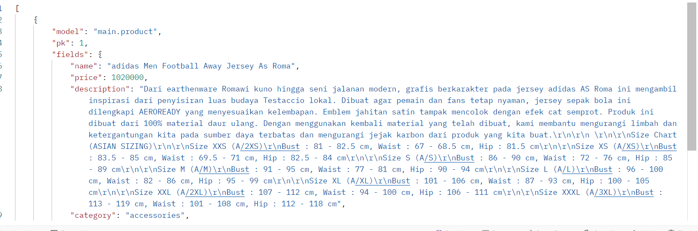
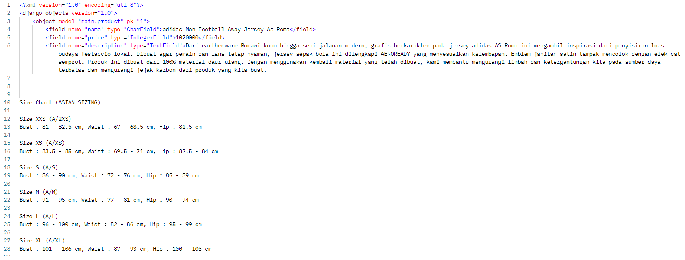

https://elsa-mayora-lucylocketshop.pbp.cs.ui.ac.id/

Tugas 2
Jelaskan bagaimana cara kamu mengimplementasikan checklist di atas secara step-by-step (bukan hanya sekadar mengikuti tutorial). 
Untuk checklist 1, yaitu membuat sebuah proyek Django baru. Sebelum itu, saya membuat direktori lokal agar nantinya semua file proyek berada dalam satu folder khusus dan mengaktifkan virtual environment dengan menjalankan perintah "env\Scripts\activate" untuk windows. Tujuan diaktifkannya virtual environment memastikan paket yang dipakai proyek satu tidak merusak atau bertabrakan dengan proyek lain. Setelah itu, membuat projek baru dengan perintah "django-admin startproject myproject .". Di sini saya mengganti myproject dengan lucylocket_shop(tema football shop). Ketika dijalankan, Django akan membuat sebuah folder baru bernama lucylocket_shop di dalam folder saat ini. Di dalam folder tersebut, akan terdapat file manage.py yang berfungsi sebagai skrip utama untuk menjalankan perintah Django, serta sebuah subfolder lucylocket_shop/ yang berisi file settings.py, urls.py, asgi.py, dan wsgi.py sebagai kerangka dasar proyek. Setelah membuat proyek Django, langkah berikutnya adalah Checklist 2: membuat aplikasi dengan nama main. Dalam Django, sebuah proyek dapat memiliki beberapa aplikasi, dan aplikasi ini berfungsi untuk memisahkan fitur atau modul tertentu agar proyek lebih modular dan mudah dikelola. Untuk membuat aplikasi main, perintah yang digunakan adalah python manage.py startapp main. Perintah ini akan membuat sebuah folder main/ di dalam proyek yang berisi beberapa file penting, seperti views.py untuk menulis fungsi-fungsi yang handle permintaan (request) dari pengguna, models.py untuk mendefinisikan struktur data atau model database, urls.py apabila ingin mengatur routing khusus aplikasi , serta file admin.py, apps.py, dan tests.py yang mendukung pengelolaan aplikasi, konfigurasi, dan pengujian. Dengan membuat aplikasi main, proyek menjadi lebih terstruktur, sehingga setiap fitur atau modul dapat dikembangkan secara terpisah tanpa mengganggu bagian proyek lainnya. Selanjutnya adalah melakukan routing pada proyek agar aplikasi main pada proyek tersebut dapat dijalankan (Checklist 3). Routing bertugas untuk menghubungkan URL yang diketik oleh pengguna di browser dengan fungsi atau tampilan tertentu di aplikasi Django. Untuk itu, pada file urls.py utama proyek, saya menambahkan kode path('', include('main.urls')), yang berarti setiap permintaan URL akan diteruskan ke file urls.py di dalam aplikasi main. Selanjutnya, di dalam aplikasi main, dibuat file urls.py jika belum ada, dan diatur jalur URL spesifik yang memetakan ke fungsi-fungsi di views.py. Dengan cara ini, setiap permintaan dari pengguna akan ditangani dengan benar oleh aplikasi main, sehingga fitur-fitur yang dikembangkan dalam aplikasi tersebut dapat diakses melalui browser. Checklist 4, membuat model pada aplikasi main dengan nama Product dan memiliki atribut wajib sebagai berikut. Di aplikasi 'main', dibuat model Product untuk menyimpan data produk dengan atribut penting seperti name, price, description, thumbnail, category, dan is_featured, sehingga data produk dapat dikelola dan ditampilkan dalam aplikasi. Setelah membuat model Product, langkah berikutnya adalah membuat fungsi pada views.py yang akan mengembalikan data ke template HTML(Checklist 5). Fungsi ini bertujuan menampilkan informasi sederhana seperti nama aplikasi, serta nama dan kelas. Di dalam fungsi, data yang ingin ditampilkan dikemas ke dalam sebuah context dan dikirim ke template menggunakan perintah render. Dengan begitu, ketika fungsi ini dipanggil, template HTML dapat menampilkan informasi yang sesuai kepada pengguna. Langkah selanjutnya adalah membuat routing pada urls.py aplikasi main untuk memetakan fungsi yang telah dibuat di views.py(Checklist 6). Routing ini menentukan URL yang akan diakses user di browser dan menghubungkannya dengan fungsi view yang tepat. Dengan menambahkan path yang sesuai di main/urls.py, setiap permintaan ke URL tersebut akan diarahkan ke fungsi view, sehingga informasi dari views.py bisa ditampilkan melalui template HTML. Terakhir, melakukan deployment ke PWS terhadap aplikasi yang sudah dibuat sehingga nantinya dapat diakses melalui Internet(Checlist 7). Untuk melakukan deployment harus membuat terlebih dahulu membuat new project, dan nantinya akan menambahkan informasi terkait URL deployment PWS pada ALLOWED_HOSTS. yang ada pada settings.py di proyek Django yang sudah dibuat tadi dan lakukan git add, commit, dan push.

2. https://drive.google.com/file/d/1rJi5BmXpP2relLrbvK492l40n2u_JjWM/view?usp=drive_link note: penjelasan ada di bagannya.

3. Jelaskan peran settings.py dalam proyek Django!
settings.py dalam proyek Django berperan sebagai konfigurasi dari seluruh proyek Django. Di dalamnya mengatur hal-hal penting seperti koneksi database, aplikasi yang terpasang (INSTALLED_APPS), middleware, pengaturan template, lokasi file statis, dan pengaturan keamanan. Saat menambahkan aplikasi main untuk lucylocket-shop, saya menambahkan 'main' ke INSTALLED_APPS agar Django mengenali aplikasi ini. Tanpa settings.py, Django tidak tahu aplikasi apa saja yang aktif, di mana menyimpan data, dan bagaimana menangani request, sehingga aplikasi tidak bisa berjalan dengan benar.

4. Bagaimana cara kerja migrasi database di Django?
Terdapat dua  tahap, yang pertama yaitu menjalankan perintah "python manage.py makemigrations", Django membaca perubahan pada model yang belum diaplikasikan ke dalam basis data dan membuat skrip migrasi. Kemudian perintah "python manage.py migrate", Django mengeksekusi skrip migrasi ke database, membuat atau mengaplikasikan perubahan model yang tercantum dalam berkas migrasi ke basis data dengan menjalankan perintah sebelumnya.

5. Menurut Anda, dari semua framework yang ada, mengapa framework Django dijadikan permulaan pembelajaran pengembangan perangkat lunak?
karena Django menyediakan banyak fitur bawaan yang memudahkan pembuatan aplikasi web secara cepat dan terstruktur. Dengan menggunakan pola arsitektur MVT (Model-View-Template), Django membantu pemula memahami pemisahan logika, tampilan, dan data. Implementasi seperti pada aplikasi yang saya buat yaitu lucylocket-shop, misalnya menunjukkan bahwa dengan Django bisa langsung membuat model Product, mengatur routing di urls.py, menampilkan data di template HTML tanpa harus menulis banyak kode dari nol.

6. Apakah ada feedback untuk asisten dosen tutorial 1 yang telah kamu kerjakan sebelumnya?
Asdos sangat membantu dalam pengerjaan tutorial 1 dan dalam menjawab pertanyaan. Terima kasih kakak asdos

Tugas 3
1. Jelaskan mengapa kita memerlukan data delivery dalam pengimplementasian sebuah platform?
Data delivery adalah proses data yang sudah dihasilkan bisa sampai ke pihak yang membutuhkan baik user, sistem lain, ataupun layanan analitik. Data delivery diperlukan dalam pengimplementasian sebuah platform karena tanpa mekanisme delivery yang baik, data bisa hilang, rusak, atau tidak sinkron. 

2. Menurutmu, mana yang lebih baik antara XML dan JSON? Mengapa JSON lebih populer dibandingkan XML?
Menurut saya, sebenarnya tidak ada yang benar-benar lebih baik antara XML dan JSON, karena keduanya memiliki fungsi serta keunggulannya masing-masing. XML biasanya lebih cocok digunakan ketika diperlukan struktur data yang kompleks, validasi ketat dengan schema, atau ketika harus berinteraksi dengan sistem lama. Sementara itu, JSON lebih sering dipakai dalam aplikasi modern, terutama web dan mobile, karena formatnya lebih sederhana, ringkas, dan mudah dipahami. Alasan mengapa JSON lebih populer dibandingkan XML adalah karena JSON memiliki ukuran data yang lebih kecil, lebih mudah dibaca oleh manusia maupun diproses oleh mesin, parsing-nya lebih cepat, serta langsung kompatibel dengan JavaScript yang menjadi bahasa utama di web. Selain itu, sebagian besar API modern seperti REST API dan layanan cloud juga secara default menggunakan JSON. Oleh karena itu, JSON dianggap lebih praktis dan efisien untuk kebutuhan pertukaran data di platform masa kini, sementara XML tetap relevan untuk kasus khusus yang membutuhkan struktur data dan validasi yang lebih kompleks.

3. Jelaskan fungsi dari method is_valid() pada form Django dan mengapa kita membutuhkan method tersebut?
is_valid() pada form Django berfungsi untuk memastikan bahwa data yang dikirim user sudah sesuai aturan validasi sebelum diproses lebih lanjut. Saat form menerima input dari user melalui request.POST, Django akan menaruh data tersebut ke dalam objek form, lalu is_valid() akan mengecek apakah semua field yang wajib terisi sudah lengkap, tipe data sesuai, serta menjalankan validasi tambahan yang telah definisikan. Jika semua validasi lolos maka akan mengembalikan nilai True, sedangkan jika ada kesalahan akan mengembalikan False.

4. Mengapa kita membutuhkan csrf_token saat membuat form di Django? Apa yang dapat terjadi jika kita tidak menambahkan csrf_token pada form Django? Bagaimana hal tersebut dapat dimanfaatkan oleh penyerang?
csrf_token yaitu token yang disediakan Django untuk mencegah CSRF (Cross-Site Request Forgery). csrf_token diperlukan untuk memastikan bahwa permintaan yang dikirim lewat form berasal dari user yang sah, maksudnya adalah bukan dari website lain yang menyamar. Yang terjadi apabila tidak menambahkan csrf_token pada form Django adalah Django tidak bisa memverifikasi asal request, request bisa ditolak atau rentan terhadap serangan csrf. Hal ini dapat dimanfaatkan penyerang untuk membuat halaman/form tersembunyi yang mengirim POST atas nama user (misallnya transfer uang, ubah data) saat user yang sedang login mengunjungi halaman tersebut.

5. Jelaskan bagaimana cara kamu mengimplementasikan checklist di atas secara step-by-step (bukan hanya sekadar mengikuti tutorial).
Dalam mengerjakan tugas ini, langkah pertama yang saya lakukan adalah menambahkan empat buah fungsi views baru di views.py. Keempat fungsi tersebut digunakan untuk menampilkan data produk yang sudah tersimpan di database dalam format XML dan JSON, baik untuk semua data maupun berdasarkan ID tertentu. Hal ini diperlukan karena aplikasi modern sering membutuhkan data delivery dalam format standar agar bisa digunakan oleh aplikasi lain, seperti frontend, aplikasi mobile, maupun sistem eksternal. JSON dan XML dipilih karena keduanya merupakan format pertukaran data yang umum digunakan. Setelah membuat fungsi views, saya menambahkan routing URL di urls.py untuk setiap fungsi tersebut. Penambahan URL ini bertujuan agar setiap view dapat diakses melalui endpoint tertentu, misalnya /products/json/ atau /products/xml/. Dengan adanya URL, fungsi yang sudah dibuat dapat diuji melalui browser maupun Postman, serta memungkinkan sistem lain untuk mengonsumsi data dari aplikasi. Langkah berikutnya adalah membuat halaman utama main.html yang menampilkan daftar produk yang ada di database. Pada halaman ini, saya menambahkan tombol Add yang mengarahkan ke halaman form untuk menambah produk baru, serta tombol Detail pada setiap produk yang menampilkan informasi lebih lengkap mengenai produk tersebut. Untuk mendukung tombol Add, saya membuat halaman form create_product.html menggunakan ProductForm. Form ini menerima input dari pengguna seperti nama produk, harga, dan deskripsi. Django menyediakan method is_valid() yang berfungsi memvalidasi input, sehingga hanya data yang sesuai aturan yang dapat disimpan ke dalam database. Hal ini menjaga integritas data agar tidak terjadi error akibat input yang tidak valid. Selain itu, saya juga menambahkan halaman detail (product_detail.html) yang menampilkan informasi lengkap sebuah produk berdasarkan ID.

 ss json
 ss xml

Tugas 4
1. Apa itu Django AuthenticationForm? Jelaskan juga kelebihan dan kekurangannya.
AuthenticationForm pada Django merupakan sebuah formulir bawaan yang disediakan oleh modul django.contrib.auth.forms. Formulir ini digunakan untuk menangani proses autentikasi dasar, yaitu memverifikasi kombinasi username dan password yang dimasukkan oleh pengguna. Secara internal, formulir ini memanggil fungsi authenticate() untuk mengecek kecocokan kredensial dengan data pengguna yang tersimpan di sistem. Kelebihan dari AuthenticationForm adalah kemudahan penggunaannya karena sudah disediakan oleh Django secara default sehingga developer tidak perlu membuatnya dari awal. Form ini terintegrasi dengan sistem autentikasi Django yang kuat dan aman, termasuk dukungan terhadap hashing password dan perlindungan terhadap serangan umum seperti brute force. Sistem ini juga mengikuti prinsip keamanan yang ketat, sehingga cocok untuk aplikasi web yang memerlukan autentikasi pengguna. Untuk kekurangannya adalah AuthenticationForm memiliki fitur yang standar dan terbatas pada autentikasi sederhana, sehingga jika aplikasi memerlukan autentikasi yang lebih kompleks seperti multi-faktor, OAuth, atau kustomisasi khusus, developer harus menyesuaikan sendiri atau menggunakan solusi tambahan.

2. Apa perbedaan antara autentikasi dan otorisasi? Bagaiamana Django mengimplementasikan kedua konsep tersebut?
Autentikasi adalah proses verifikasi identitas pengguna dengan memastikan bahwa pengguna benar-benar sesuai dengan identitas yang mereka nyatakan, biasanya melalui kredensial seperti username dan password. Sementara itu, otorisasi adalah proses pemberian hak atau izin kepada pengguna yang sudah terautentikasi untuk mengakses resource atau melakukan tindakan tertentu dalam sistem. Implementasinya dalam Django untuk autentikasi, dalam sebuah view biasanya ketika request POST diterima, AuthenticationForm diinstansiasi dengan data POST tersebut. Jika form valid (berarti username dan password benar), maka objek user diambil dari form, dan metode login() Django dipanggil untuk membuat sesi login bagi pengguna. Jika tidak valid, pengguna akan diberikan pesan error bahwa kredensial salah. Implementasi otorisasi di Django biasanya dilakukan dengan menggunakan sistem permission dan grup yang sudah disediakan oleh Django secara bawaan. Otorisasi ini berfungsi untuk mengatur hak akses pengguna yang telah terautentikasi agar hanya dapat mengakses resource atau melakukan tindakan tertentu sesuai izin yang diberikan. Contoh implementasi permission di views.py dengan decorator yaitu @login_required. Dekorator ini berfungsi untuk membatasi akses suatu view hanya untuk pengguna yang sudah melakukan autentikasi (login). Jika pengguna belum login, mereka akan otomatis diarahkan ke halaman login yang ditentukan oleh parameter login_url, misalnya '/login'.

3. Apa saja kelebihan dan kekurangan session dan cookies dalam konteks menyimpan state di aplikasi web?
Session menyimpan data di sisi server, sementara klien hanya menyimpan sebuah identifier (biasanya berupa sessionid) dalam bentuk cookie. Kelebihan utama session adalah tingkat keamanannya lebih baik karena data pengguna tidak disimpan langsung di sisi klien, melainkan di server yang lebih sulit dimanipulasi. Session juga tidak terbatas pada kapasitas kecil sehingga dapat menyimpan data dalam jumlah yang relatif besar. Selain itu, server memiliki kontrol penuh untuk menghapus, memperbarui, atau merotasi session kapan saja. Kekurangan session adalah menambah beban penyimpanan dan manajemen di sisi server. Semakin banyak pengguna yang aktif, semakin besar pula sumber daya yang dibutuhkan untuk menyimpan data session. Cookies, di sisi lain, menyimpan data langsung pada browser klien. Kelebihannya adalah sederhana, ringan, dan tidak membebani server karena semua data tersimpan di sisi klien. Cookies cocok untuk menyimpan informasi non-sensitif seperti preferensi tampilan, bahasa, atau pengaturan antarmuka. Cookies juga dapat bertahan lama di browser sehingga memudahkan fitur seperti remember me. Namun, kelemahan cookies adalah kapasitasnya terbatas (umumnya sekitar 4 KB per cookie), mudah diubah oleh pengguna, serta rentan terhadap risiko keamanan seperti pencurian melalui serangan XSS atau penyalahgunaan melalui CSRF. Oleh karena itu, cookies tidak disarankan untuk menyimpan data sensitif tanpa perlindungan tambahan seperti enkripsi atau tanda tangan digital.

4. Apakah penggunaan cookies aman secara default dalam pengembangan web, atau apakah ada risiko potensial yang harus diwaspadai? Bagaimana Django menangani hal tersebut?
Pada soal no 3, disinggung sedikit terkait "cookies tidak disarankan untuk menyimpan data sensitif tanpa perlindungan tambahan", penggunaan ookies dalam pengembangan web tidak sepenuhnya aman secara default apalagi tanpa perlindungan tambahan. Cookies memang memudahkan pertukaran data antara klien dan server, tetapi ada sejumlah risiko potensial yang perlu diwaspadai, seperti pencurian cookie melalui serangan man-in-the-middle jika data tidak dienkripsi, akses tidak sah akibat serangan XSS (Cross-Site Scripting) yang memungkinkan penyerang membaca cookie dari browser, serta penyalahgunaan melalui serangan CSRF (Cross-Site Request Forgery) yang memanfaatkan fakta bahwa browser secara otomatis mengirimkan cookies pada setiap permintaan ke server. Untuk menangani risiko tersebut, Django menyediakan berbagai mekanisme keamanan yang dapat diaktifkan melalui konfigurasi. Misalnya, opsi SESSION_COOKIE_SECURE = True dan CSRF_COOKIE_SECURE = True memastikan cookie hanya dikirim melalui koneksi HTTPS, sehingga mencegah kebocoran data pada koneksi tidak terenkripsi. Opsi SESSION_COOKIE_HTTPONLY = True dan CSRF_COOKIE_HTTPONLY = True mencegah cookie diakses melalui JavaScript, sehingga memperkecil risiko pencurian cookie lewat XSS. Django juga mendukung atribut SameSite melalui pengaturan SESSION_COOKIE_SAMESITE dan CSRF_COOKIE_SAMESITE untuk membatasi pengiriman cookie lintas situs, yang membantu mencegah serangan CSRF.

5. Jelaskan bagaimana cara kamu mengimplementasikan checklist di atas secara step-by-step (bukan hanya sekadar mengikuti tutorial).
Checklist 1, Mengimplementasikan fungsi registrasi, login, dan logout untuk memungkinkan pengguna mengakses aplikasi sebelumnya sesuai dengan status login/logoutnya. Pada file views.py menambahkan fungsi registrasi, login, dan logout, fungsi register berfungsi menghasilkan formulir regitrasi secara otomatis dan akan generate akun user ketika sudah  di submit dari form. Tidak lupa juga untuk menambahkan berkas HTML register, untuk menampilkan halaman regist kepada user. Selanjutnya, menambahkan import dan rute url register di urls.py subdirektori main. Lanjut, sebelum membuat fungsi login saya menambahkan import authenticate, login, dan AuthenticationForm pada file views.py, fungsi yang di import tadi digunakan untuk mengecek kecocokan kredensial dengan data pengguna yang tersimpan di sistem. Kemudian, saya membuat fungsi login_user yang akan menerima parameter request, dan akan mengecek apakah username dan password sudah benar. Setelah itu, membuat html untuk login yang akan menampilkan halaman login kepad user. Sama  seperti tadi, akan menambahkan import dan rute url login pada urls.py subdirektori main. Terakhir untuk checklist ini yaitu membuat fungsi logout berserta htmlnya. Checklist selanjutnya, yaitu membuat dua (2) akun pengguna dengan masing-masing tiga (3) dummy data menggunakan model yang telah dibuat sebelumnya untuk setiap akun di lokal. Disini saya mengimplementasikannya dengan regist 2 akun dengan username myraaels_ dan patrickstar, kemudian passwordnya. Setelah itu, saya mencoba login dan menambahkan 3 product di masing-masing akun user. Cheklist selnjutnya, yaitu menghubungkan model Product dengan User. Langkah awal implementasinya adalah  menambahkan import User pada file models.py, dan potongan kode user = models.ForeignKey(User, on_delete=models.CASCADE, null=True) , potongan kode tersebut memungkinkan product yang sudah ada sebelumnya tetap valid tanpa harus memiliki user, dan apabila user dihapus semua product milik user juga akan terhapus. Checklist terkhir, menampilkan detail informasi pengguna yang sedang logged in seperti username dan menerapkan cookies seperti last_login pada halaman utama aplikasi. Untuk menampilkan detail informasi pengguna yang sedang login, seperti username dan juga cookie last_login, langkah pertama adalah menambahkan logika pada fungsi login. Setelah proses autentikasi berhasil, bisa langsung menggunakan fungsi response.set_cookie() untuk menyimpan nilai last_login ke dalam cookie. Nilainya bisa berupa timestamp saat user berhasil login. Dengan begitu, setiap kali pengguna berhasil masuk, browser akan menyimpan data sederhana berupa waktu login terakhir. Selanjutnya, pada halaman utama (misalnya di fungsi show_main), cukup mengambil data dari objek request.user untuk mendapatkan username, dan dari request.COOKIES.get('last_login') untuk mengambil nilai cookie yang sudah diset tadi. Keduanya kemudian dimasukkan ke dalam context dictionary, lalu dikirimkan ke template agar bisa ditampilkan dengan mudah. Dengan cara ini, ketika user membuka dashboard, ia akan langsung melihat siapa yang sedang login (username) dan kapan terakhir kali ia login berdasarkan cookie yang disimpan.

Tugas 5
1. Jika terdapat beberapa CSS selector untuk suatu elemen HTML, jelaskan urutan prioritas pengambilan CSS selector tersebut!
Terdapat 4 tingakatan dalam CSS Specificity Hierarchy, untuk setiap jenis dari CSS selector mempunyai posisi di specificity hierarchy. Untuk highest priority yaitu inline styles (memberikan style langsung pada elemen melalui atribut style), contohnya <h1 style="color: pink;">. Selanjutnya, second highest priority yaitu id selectors ID memiliki bobot yang lebih tinggi dibandingkan class dan elemen, contohnya #header. Untuk third highest priority, selectornya yaitu Classes, attribute selectors and pseudo-classes, ini adalah selektor yang digunakan untuk mengidentifikasi elemen berdasarkan kelas, atribut, atau kondisi tertentu (pseudo-class), contohnya .test, [type="text"], :hover. Kemudian Elements and pseudo-elements, yang  memiliki specificity terendah. Elemen selectors adalah selektor yang mengidentifikasi elemen berdasarkan nama tag-nya, sementara pseudo-elements digunakan untuk mengatur bagian-bagian tertentu dari elemen, contohnya *, where(). Terakhir, Universal selector and :where() yang menduduki no priority, contohnya *, where().

2. Mengapa responsive design menjadi konsep yang penting dalam pengembangan aplikasi web? Berikan contoh aplikasi yang sudah dan belum menerapkan responsive design, serta jelaskan mengapa!
Responsive design adalah konsep pengembangan aplikasi web untuk memastikan tampilan website atau aplikasi yang dapat menyesuaikan diri dengan berbagai ukuran llayar, mulai dari smartphone, tablet, hingga desktop. Dengan menerapkan desain yang responsif, pengguna tidak perlu melakukan zoom atau scroll horizontal ketika mengakses aplikasi di perangkat yang lebih kecil, sehingga pengalaman pengguna (user experience) menjadi lebih baik. Selain itu, responsive design juga meningkatkan aksesibilitas dan jangkauan, karena satu basis kode dapat dipakai untuk banyak perangkat tanpa perlu membuat versi terpisah. Contoh aplikasi yang sudah menerapkan responsive design adalah situs e-commerce seperti Tokopedia atau Shopee. Pada aplikasi-aplikasi ini, tata letak dan ukuran elemen secara otomatis menyesuaikan dengan lebar layar. Misalnya, grid produk di Tokopedia yang pada layar desktop ditampilkan dalam lima atau enam kolom, akan berubah menjadi dua kolom saja di layar smartphone agar tetap mudah dibaca dan digunakan. Sebaliknya, masih banyak website lama yang belum menerapkan responsive design, misalnya situs berbasis layout tabel atau landing page event lawas yang didesain hanya untuk ukuran layar desktop. Ketika dibuka di perangkat mobile, teks terlihat terlalu kecil, gambar terpotong, dan pengguna harus melakukan scroll horizontal, sehingga pengalaman menggunakannya terasa tidak nyaman.

3. Jelaskan perbedaan antara margin, border, dan padding, serta cara untuk mengimplementasikan ketiga hal tersebut!
Margin adalah ruang kosong yang berada di luar elemen, berfungsi untuk memberikan jarak antara elemen tersebut dengan elemen lain di sekitarnya. Margin tidak memiliki warna atau latar belakang, sehingga hanya berupa ruang kosong. Misalnya, margin dapat digunakan agar sebuah paragraf tidak menempel langsung dengan gambar di sebelahnya. Border adalah garis pembatas yang mengelilingi elemen, terletak di antara margin dan padding. Border dapat diberi warna, ketebalan, dan gaya tertentu (misalnya solid, dashed, atau dotted). Border biasanya digunakan untuk memperjelas batas suatu elemen, seperti membuat kotak di sekitar teks. Padding adalah ruang kosong yang berada di dalam elemen, yaitu jarak antara konten (seperti teks atau gambar) dengan garis border. Berbeda dengan margin, area padding mengikuti warna atau latar belakang elemen, sehingga memberi “ruang bernafas” bagi konten di dalamnya agar tidak menempel langsung pada border. Contoh implementasi dalam CSS, 
.box {
  margin: 20px;             
  border: 2px solid black;   
  padding: 15px;        
}
Elemen tersebut akan memiliki jarak 20 piksel dari elemen lain (margin), dikelilingi oleh garis tepi hitam setebal 2 piksel(border), dan kontennya berada 15 piskel dari garis border sehingga terlihat lebih rapi(padding).

4. Jelaskan konsep flex box dan grid layout beserta kegunaannya!
Flexbox atau Flexible Box Layout adalah sebuah metode tata letak dalam CSS yang digunakan untuk mengatur elemen-elemen di dalam sebuah wadah (container) secara satu dimensi, baik dalam baris (row) maupun kolom (column). Dengan menggunakan flexbox, pengembang dapat menyusun elemen agar lebih fleksibel, rapi, dan mudah menyesuaikan diri dengan ukuran layar. Kegunaan flexbox adalah untuk mengatur tata letak satu dimensi, baik baris maupun kolom, sehingga cocok dipakai pada navigasi, tombol, atau daftar elemen yang tersusun lurus. Kegunaan grid layout adalah untuk mengatur tata letak dua dimensi berupa baris dan kolom sekaligus, sehingga lebih tepat digunakan untuk kerangka halaman, dashboard, atau galeri.

5. Jelaskan bagaimana cara kamu mengimplementasikan checklist di atas secara step-by-step (bukan hanya sekadar mengikuti tutorial)!
Untuk checklist pertama, saya mengimplementasikannya dengan menambahkan tailwind(untuk melakukan styling terhadap aplikasi Django) ke aplikasi, kemudian selanjutnya saya menambah fungsi edit dan delete product dan menambahkan rute url ke urls.py pada subdirektori main. Selanjutnya pada main.html saya menambahkan button untuk mengedit suatu product dan delete product. Checklist 2, untuk melakukan styling pada aplikasi dengan tailwind, saya menambahkan global.css(bisa menambahkan  kelas custom atau style css) melakukan kustomisasi halaman login, register, tambah product, edit product, dan detail product agar tampilan lebih konsisten dan menarik. Pada login page akan menampilkan teks Welcome back to Lucy Locket Shop dan konten tersbut berada pada di tengah, lalu apabila salah memasukkan username atau password akan menampilkan pesan Please enter a correct username and password. Note that both fields may be case-sensitive. Untuk halaman register implementasinya sama dengan halaman login tadi. Pada halaman Edit Product, saya melakukan styling menggunakan class bawaan Tailwind CSS agar tampilan lebih rapi, konsisten, dan responsif. Form saya letakkan dalam sebuah kontainer terpusat dengan latar belakang abu-abu muda sehingga bagian utama berwarna putih lebih menonjol. Setiap field memiliki label yang jelas, jarak antar elemen seragam, serta pesan bantuan atau error dengan warna berbeda agar mudah dipahami. Untuk tombol aksi, saya membedakan peran antara tombol Cancel yang bergaya sederhana dan tombol Update Product yang ditonjolkan dengan warna hijau. Dengan styling ini, halaman edit produk menjadi lebih bersih, mudah digunakan, dan tetap menarik secara visual. Selanjutnya untuk page detail product, struktur utamanya berupa card putih (bg-white rounded-lg border) yang berisi header, gambar, deskripsi, dan info penjual. Di bagian atas saya tampilkan breadcrumb balik ke daftar lewat tautan “Back to Products”. Lalu, saya render badge kategori memakai product.get_category_display dan, bila produk ditandai unggulan, saya munculkan badge Featured secara kondisional. Judul produk dibuat menonjol dengan tipografi besar, sedangkan meta informasi seperti tanggal dibuat (jika ada), stok, dan harga saya tampilkan dalam baris kecil harga diformat lebih mudah dibaca menggunakan humanize (intcomma). Selanjutnya untuk card product, bagian atas berisi thumbnail dalam rasio 16:9; jika URL gambar valid maka ditampilkan, tetapi bila gagal/belum ada saya gunakan fallback ke aset statis melalui onerror dan . Di atas gambar saya tampilkan badge kategori (productget_category_display) dan, bila produk ditandai unggulan, muncul badge Featured; untuk stok habis saya sediakan badge Out of stock yang ditampilkan bisa pakai product.is_out_of_stock seperti di kode atau ganti dengan logika product.stock == 0. Di area konten, saya menampilkan ringkasan Stock, judul produk yang menjadi tautan ke halaman detail (show_product), harga yang diformat lebih mudah dibaca memakai filter humanize intcomma, serta deskripsi singkat yang dipotong dengan truncatewords agar tinggi kartu tetap seragam. Pada bagian Actions, tombol Read more selalu ada, sementara Edit dan Delete hanya muncul bila pengguna sedang login dan merupakan pemilik produk (product.user == user). Kemudia saya juga membuat navbar, saya menjadikan tiap tautan (Home, Shoes, dst.) sebagai filter kategori dengan atribut data-filter. Di halaman daftar, setiap kartu produk dibungkus elemen cardproduct yang punya data-category (mis. shoes, accessories). Saat tautan diklik, JavaScript mencegah pindah halaman, membaca nilai data-filter, lalu menyembunyikan/menampilkan item grid .cardproduct dengan menambah/menghapus class hidden, sehingga layout tetap rapi tanpa kolom kosong. Script juga memberi gaya aktif pada tautan yang dipilih dan menutup menu mobile jika sedang terbuka. Jika bukan di halaman daftar (tidak ada cardproduct), script otomatis tidak jalan.

Tugas 6
1. Apa perbedaan antara synchronous request dan asynchronous request?
Synchronous request adalah jenis permintaan di mana proses akan menunggu respons dari server terlebih dahulu sebelum melanjutkan ke langkah berikutnya. Dengan kata lain, selama proses pengiriman dan penerimaan data berlangsung, pengguna tidak dapat melakukan interaksi lain. Sebaliknya, asynchronous request memungkinkan proses berjalan di latar belakang (background) tanpa harus menunggu respons dari server. Aplikasi atau halaman web tetap dapat berfungsi dan merespons tindakan pengguna sambil menunggu hasil dari server. Setelah respons diterima, hasilnya akan diproses dan ditampilkan secara dinamis tanpa memuat ulang halaman.

2. Bagaimana AJAX bekerja di Django (alur request–response)?
Prosesnya dimulai ketika terjadi suatu event di browser, misalnya ketika pengguna menekan tombol atau mengisi formulir. JavaScript kemudian membuat sebuah objek XMLHttpRequest (atau menggunakan metode modern seperti fetch()), yang berfungsi untuk mengirim request ke server melalui Internet secara asinkron. Setelah permintaan dikirim, server akan memproses data yang diterima, misalnya membaca database atau menjalankan logika tertentu, dan kemudian mengembalikan response dalam bentuk data, biasanya berupa JSON, XML, atau HTML parsial.

3. Apa keuntungan menggunakan AJAX dibandingkan render biasa di Django?
AJAX memungkinkan pembaruan data secara parsial, sehingga hanya bagian tertentu dari halaman yang berubah tanpa perlu memuat ulang seluruh halaman. Hal ini menjadikan proses lebih cepat, efisien, dan menghemat penggunaan sumber daya seperti bandwidth. Selain itu, interaksi pengguna menjadi lebih dinamis dan responsif, karena setiap perubahan atau pembaruan data dapat langsung terlihat di layar. Dengan demikian, AJAX berkontribusi terhadap peningkatan performa serta kenyamanan pengguna dalam mengakses aplikasi web.

4. Bagaimana cara memastikan keamanan saat menggunakan AJAX untuk fitur Login dan Register di Django?
Menggunakan protokol HTTPS agar data yang dikirim dan diterima terenkripsi dengan baik, menerapkan CSRF Token (Cross-Site Request Forgery) yang telah disediakan oleh Django untuk mencegah serangan pemalsuan permintaan dari pihak luar, melakukan validasi data di sisi server, bukan hanya di sisi klien, untuk menghindari manipulasi data oleh pengguna, memanfaatkan sistem autentikasi bawaan Django sehingga penyimpanan kata sandi menggunakan metode hashing yang aman, membatasi akses lintas domain (Cross-Origin Resource Sharing / CORS) hanya untuk domain yang terpercaya, dan terakhir menyembunyikan detail pesan kesalahan pada proses login agar tidak memberikan informasi sensitif kepada pihak yang tidak bertanggung jawab.

5. Bagaimana AJAX mempengaruhi pengalaman pengguna (User Experience) pada website?
Dengan AJAX, interaksi pada website menjadi lebih cepat, interaktif, dan efisien, karena pengguna tidak perlu menunggu proses reload halaman secara keseluruhan. Misalnya, ketika user kirim form atau memperbaharui data, hasil dapat langsung ditampilkan pada halaman yang sama. Hal ini meningkatkan kenyamanan dan efektivitas dalam berinteraksi dengan sistem.

